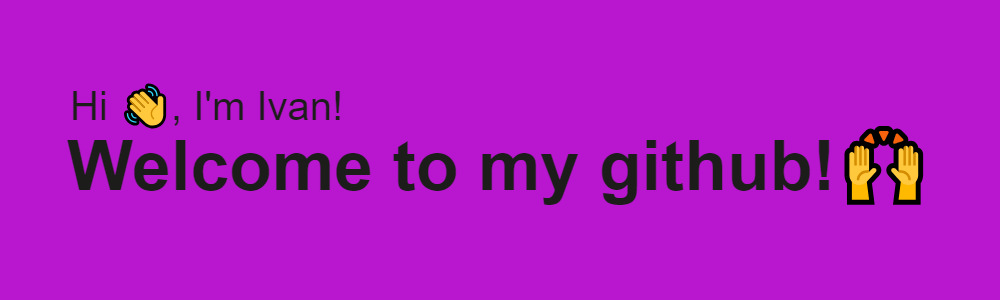

### about me
- :computer: I make websites (html, javascript, css3, sass, scss, BAM)
- :books: i'm currently learning fullstack developer, system adm.
- :mortar_board: 2025 university МТУСИ

 <h3>front-end / back-end:</h3>

<h3>base:</h3>

<h3>IDEs/Editors</h3>

|Visual Studio Code||
|--|--|
|PhpStorm||
|Sublime Text||

    <h1>my stats:</h1>

<h3>see my codewars</h3>

